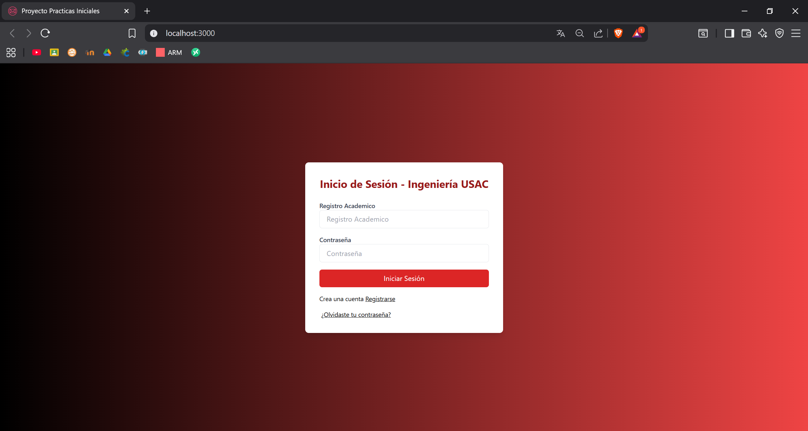
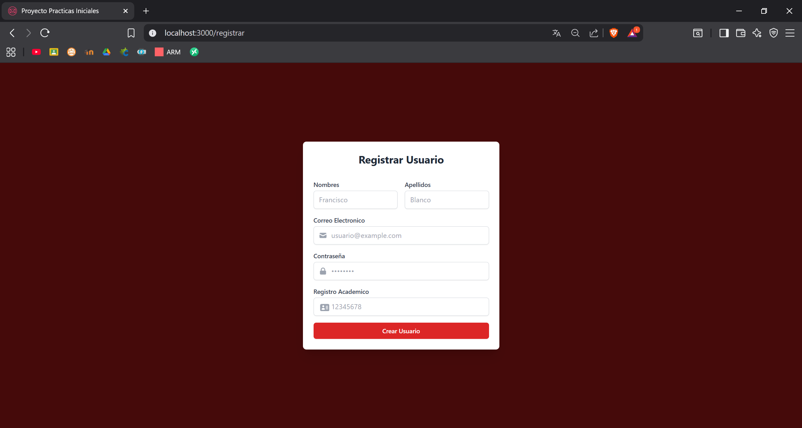
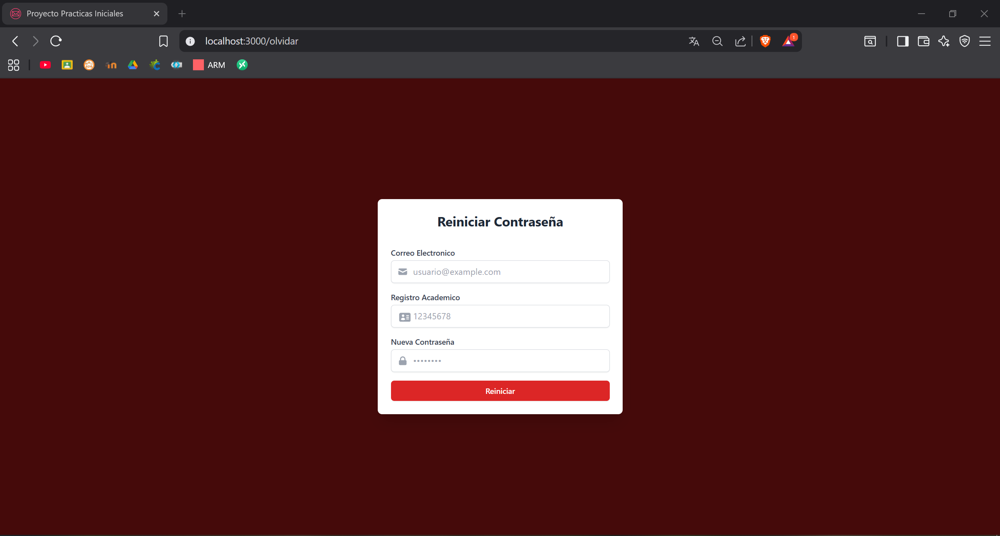
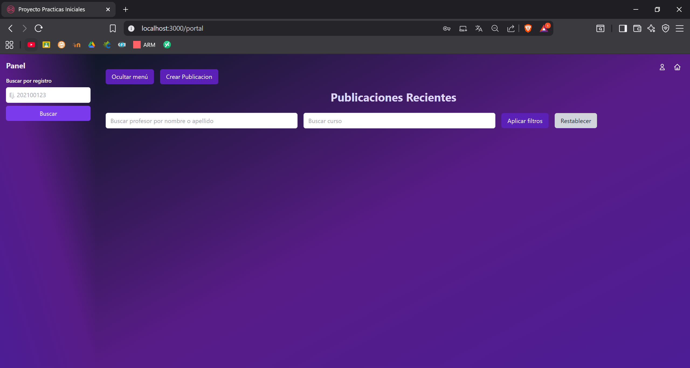
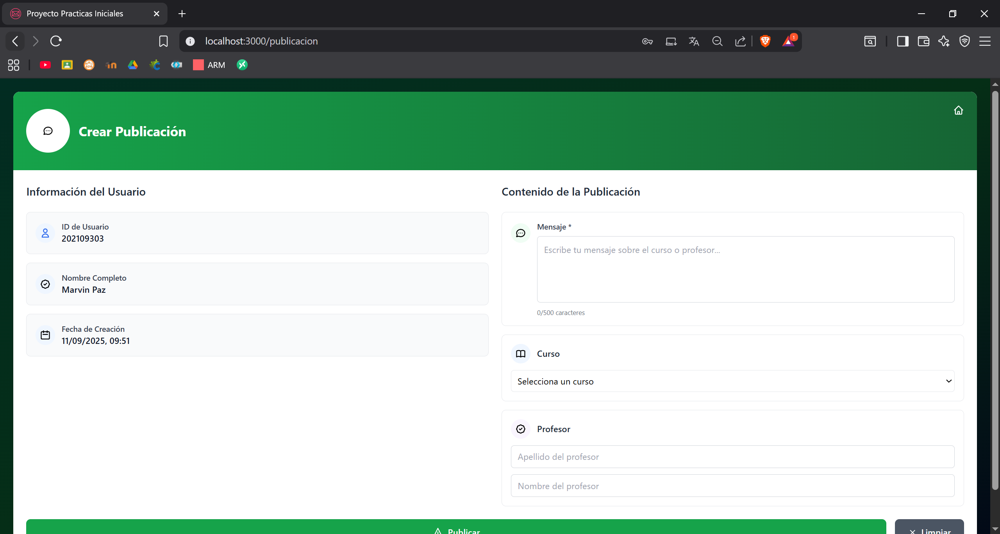
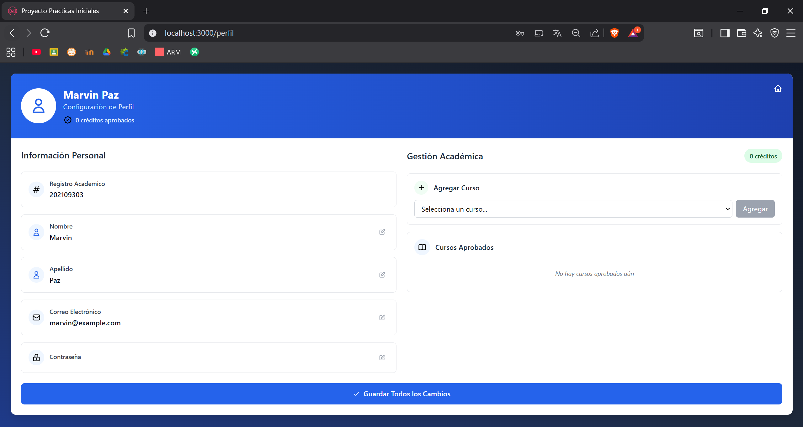
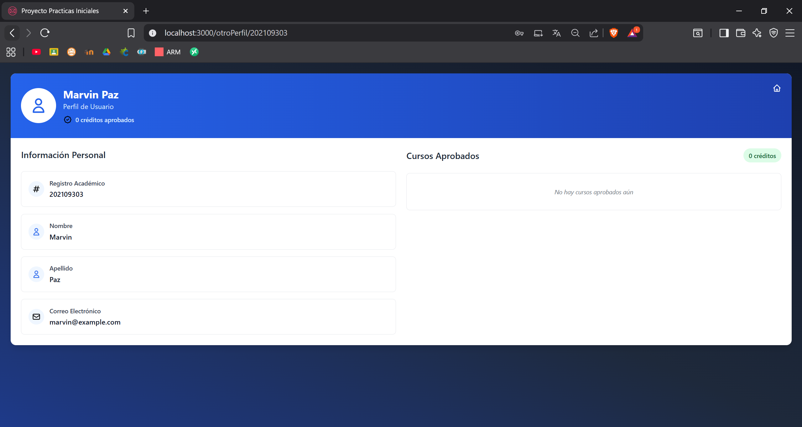

# Manual de Usuario - Portal Estudiantil USAC

## Instalación de Dependencias

### Requisitos Previos
- Node.js (versión 14 o superior)
- npm (viene incluido con Node.js)
- Backend corriendo en `http://localhost:5000`

### Instalación del Frontend
1. Navega al directorio del frontend:
   ```bash
   cd frontend
   ```

2. Instala las dependencias necesarias:
   ```bash
   npm install
   ```

3. Instala las dependencias específicas del proyecto:
   ```bash
   npm install react react-dom react-router-dom
   npm install -D tailwindcss postcss autoprefixer
   npm install @testing-library/react @testing-library/jest-dom @testing-library/user-event
   npm install web-vitals
   ```

4. Inicia la aplicación:
   ```bash
   npm start
   ```

La aplicación estará disponible en `http://localhost:3000`

---

## Guía de Uso de la Aplicación

### 1. Inicio de Sesión

**Ubicación:** Página principal (`/`)

**Descripción:** Pantalla de acceso principal para estudiantes registrados de la Facultad de Ingeniería USAC.

**Funcionalidades:**
- Ingreso con Registro Académico y Contraseña
- Enlace para crear nueva cuenta
- Enlace para recuperar contraseña olvidada
- Validación de credenciales en tiempo real
- Mensajes de error con desvanecimiento automático

**Campos requeridos:**
- Registro Académico
- Contraseña



---

### 2. Registro de Usuario

**Ubicación:** `/registrar`

**Descripción:** Formulario de registro para nuevos estudiantes de la universidad.

**Funcionalidades:**
- Registro de nuevos usuarios estudiantes
- Validación de campos obligatorios
- Verificación de formato de correo electrónico
- Confirmación de registro exitoso

**Campos requeridos:**
- Nombres
- Apellidos
- Correo Electrónico
- Contraseña
- Registro Académico



---

### 3. Recuperación de Contraseña

**Ubicación:** `/olvidar`

**Descripción:** Sistema para restablecer contraseñas olvidadas.

**Funcionalidades:**
- Restablecimiento de contraseña mediante correo y registro académico
- Validación de identidad del usuario
- Establecimiento de nueva contraseña

**Campos requeridos:**
- Correo Electrónico
- Registro Académico
- Nueva Contraseña



---

### 4. Portal Principal (Dashboard)

**Ubicación:** `/portal`

**Descripción:** Página principal donde se muestran todas las publicaciones de la comunidad estudiantil.

**Funcionalidades:**
- **Visualización de publicaciones:** Ver todas las publicaciones ordenadas por fecha
- **Sistema de filtros:**
  - Filtro por curso específico
  - Filtro por nombre/apellido de profesor
  - Botón para restablecer filtros
- **Búsqueda de estudiantes:** Por registro académico
- **Navegación rápida:**
  - Botón para crear nueva publicación
  - Acceso al perfil personal
  - Cerrar sesión
- **Sistema de comentarios:** Ver y agregar comentarios a publicaciones
- **Sidebar colapsable:** Panel lateral para búsquedas

**Elementos de la interfaz:**
- Lista de publicaciones con información de autor, curso/profesor, contenido y fecha
- Barra de filtros en la parte superior
- Botones de navegación en el header
- Panel lateral para búsquedas



---

### 5. Crear Publicación

**Ubicación:** `/publicacion`

**Descripción:** Formulario para crear nuevas publicaciones sobre cursos o profesores.

**Funcionalidades:**
- **Información automática:** Carga automática de datos del usuario logueado
- **Selección inteligente:** 
  - Seleccionar curso desde lista desplegable, O
  - Escribir nombre y apellido de profesor (con validación en tiempo real)
- **Validación de contenido:** 
  - Mensaje obligatorio (máximo 500 caracteres)
  - Verificación de profesor existente
- **Fecha automática:** Se asigna automáticamente la fecha actual

**Campos disponibles:**
- **Automáticos:** ID Usuario, Nombre Completo, Fecha
- **Requeridos:** Mensaje de la publicación
- **Opcionales (uno u otro):** Curso O Profesor (nombre y apellido)

**Validaciones:**
- No se puede seleccionar curso Y profesor simultáneamente
- El mensaje debe tener al menos 1 caracter
- Si se selecciona profesor, debe existir en la base de datos



---

### 6. Perfil de Usuario

**Ubicación:** `/perfil`

**Descripción:** Panel de gestión personal del estudiante donde puede ver y editar su información, así como gestionar sus cursos aprobados.

**Funcionalidades:**

#### Información Personal (Editable):
- **Registro Académico:** Solo lectura (no editable)
- **Nombre:** Editable con validación
- **Apellido:** Editable con validación  
- **Correo Electrónico:** Editable con formato de email
- **Contraseña:** Editable (se muestra oculta)

#### Gestión Académica:
- **Visualizar cursos aprobados:** Lista completa con créditos
- **Agregar cursos:** Selección desde lista desplegable de cursos disponibles
- **Eliminar cursos:** Quitar cursos de la lista personal
- **Contador de créditos:** Suma automática de créditos totales

#### Controles de Edición:
- Cada campo tiene botones individuales de Editar/Guardar/Cancelar
- Botón general "Guardar Todos los Cambios" para confirmar modificaciones
- Validación en tiempo real de cambios

**Indicadores visuales:**
- Contador de créditos totales en el header
- Estados de edición claramente marcados
- Confirmaciones visuales de acciones



---

### 7. Ver Perfil de Otro Usuario

**Ubicación:** `/otroPerfil/:registro`

**Descripción:** Visualización del perfil público de otros estudiantes (solo lectura).

**Funcionalidades:**
- **Información visible:**
  - Datos personales básicos (nombre, apellido, registro, correo)
  - Lista completa de cursos aprobados
  - Total de créditos acumulados
- **Solo lectura:** No se pueden editar datos de otros usuarios
- **Navegación:** Botón para volver al portal principal

**Acceso:** 
- A través de la búsqueda por registro académico en el portal principal
- URL directa con el número de registro



---

### 8. Sistema de Comentarios

**Descripción:** Funcionalidad integrada en las publicaciones del portal principal.

**Funcionalidades:**
- **Ver comentarios:** Lista de todos los comentarios de una publicación
- **Agregar comentarios:** Escribir nuevos comentarios en publicaciones
- **Información del autor:** Cada comentario muestra nombre y apellido del autor
- **Actualización en tiempo real:** Los comentarios se cargan dinámicamente

**Características:**
- Campo de texto para escribir comentarios
- Botón "Comentar" para enviar
- Lista organizada de comentarios existentes
- Identificación clara del autor de cada comentario

**[Imagen: Captura de pantalla de una publicación con comentarios]**

---

## Navegación General

### Estructura de Rutas:
- `/` - Inicio de sesión
- `/registrar` - Registro de nuevo usuario
- `/olvidar` - Recuperación de contraseña
- `/portal` - Dashboard principal
- `/publicacion` - Crear nueva publicación
- `/perfil` - Gestión de perfil personal
- `/otroPerfil/:registro` - Ver perfil de otro usuario

### Elementos Comunes:
- **Botones de navegación:** Presentes en todas las páginas internas
- **Sistema de errores:** Notificaciones que se desvanecen automáticamente
- **Responsive design:** Adaptable a diferentes tamaños de pantalla
- **Validaciones:** En tiempo real en todos los formularios

---

## Notas Importantes

1. **Autenticación:** La sesión se mantiene usando localStorage
2. **Conexión Backend:** Todas las funciones requieren conexión con el servidor en localhost:5000
3. **Validaciones:** Los formularios incluyen validación tanto en frontend como backend
4. **Responsive:** La interfaz se adapta a dispositivos móviles y de escritorio
5. **Filtros:** Solo se puede aplicar un filtro a la vez (curso O profesor)
6. **Comentarios:** Se cargan dinámicamente al hacer clic en "Ver comentarios"